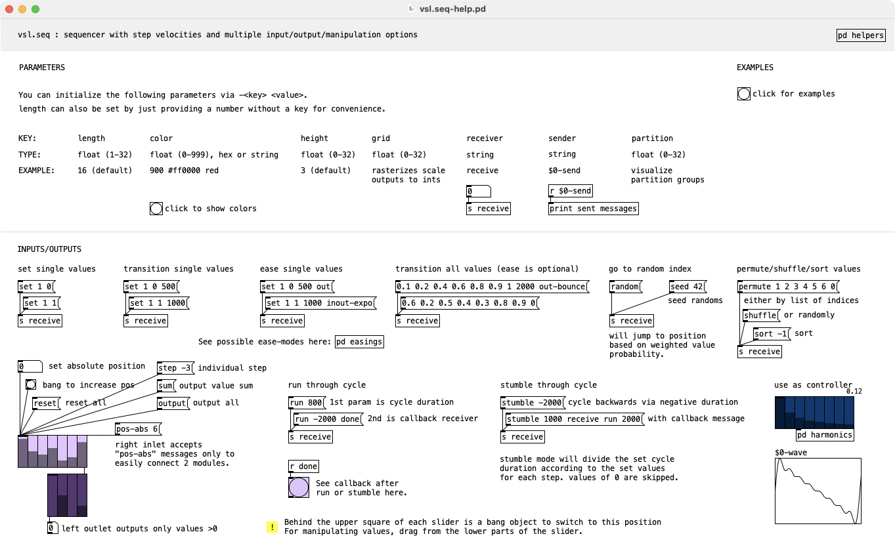

# vsl.seq
Pure Data (Pd) sequencer and control module with step velocities and multiple input/output/manipulation options

See help patch for explanation and examples.

Left outlet outputs step values. Right outlet outputs additional and contextual data.

*help patch screenshot*

*video demo (click to play)*

## Creation parameters
* `-length <value>` from 1 to 32
* `<value>` value alone will be interpreted as length for convencience
* `-height <value>` to change visible range (1..32) for better readability and usability
* `-color <rgb>` to add unreasonable beauty via decimal RGB syntax (e.g. `999` for white), hexadecimal 24bit colors (`#ffffff`) or preset color names
* `-grid <value>` to rasterize vertical resolution to an integer range instead of float from 0..1
* `-receiver <name>` to set object's receiver address
* `-sender <name>` to set object's sender address
* `-partition <value>` to set partition groups' size (0..32) for better readability

## Messages
* `bang` for stepping ahead by +1
* `<position>` to move to specified step position
* `step <step_size>` to move on by specified step size (negative values allowed - default is +1) 
* `set <index> <value> [<duration> <ease mode>]` for setting value with optional duration and ease-mode
* list of values with optional `<duration> <ease mode>` for setting all values
* `random` to output random value/index by value probability
* `seed [<value>]` to reseed random (with optional seed value)
* `permute` with list of indices to reorder sliders/values
* `shuffle` to randomly reorder sliders/values
* `sort [-1]` to sort values in descending (default) or ascending (via additional `-1`) order
* `run <duration> [<callback receiver> <callback message>]` to run through values with given cycle duration (negative values for backwards run)
* `stumble <duration> [<callback receiver> <callback message>]` to stumble through values with given cycle duration (negative values for backwards stumble) - but with duration of each step according to its value
* `output` to output all values on right outlet (mainly intended to copy sequences to another sequencer)
* `sum` to output value sum on right outlet
* `reset` to reset all values
